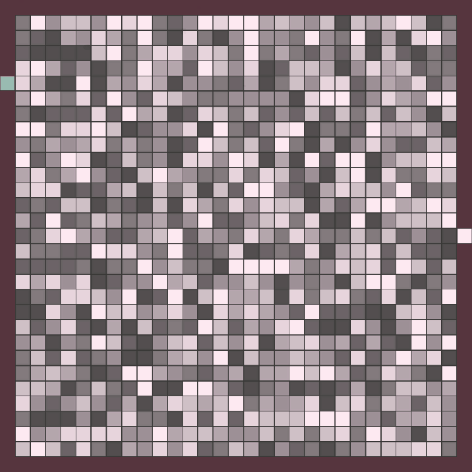
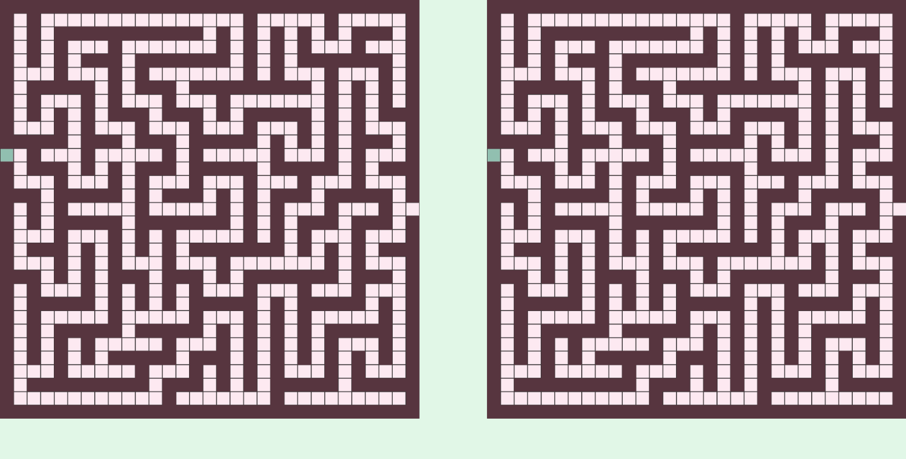

# Pathfinding Algorithm Visualizer

An interactive Unity (C#) visualizer for four classic pathfinding algorithms — Breadth-First Search, Depth-First Search, Dijkstra, and A\*. Generate a map, pick an algorithm, and watch it explore the grid step by step until it reaches the goal.

*Originally built as my final-year BSc thesis (2022), since refactored for clarity and performance.*

**Live demo: [Play it in your browser](https://filipbabicdev.itch.io/pathfinding-algorithm-visualizer)** (WebGL, hosted on itch.io — no install required)



## Features

- **Four algorithms:** BFS, DFS, Dijkstra, and A\*
- **Two map modes:**
  - *Maze* — uniform tiles with walls and a single correct path, generated with a randomized DFS (recursive backtracker).
  - *Terrain* — no walls; every tile has a movement cost (0–7), and Dijkstra/A\* find the **cheapest** path to the goal, not just any path.
- **Side-by-side Compare mode** — run two algorithms on identical maps and see which reaches the goal faster, with solve-time tracking.
- **Adjustable speed** — 1×, 5×, or 10× (5 / 25 / 50 steps per second).
- **Configurable map size** — odd dimensions from 5×5 up to 101×101 (≈10,000 tiles).
- **Tile-value overlay** — toggle to display each tile's distance/cost values.

## Compare mode

Run two algorithms at once on the same map and watch them race:



## The algorithms

| Algorithm | Strategy | Finds the shortest/cheapest path? |
|-----------|----------|-----------------------------------|
| **BFS** | Explores the frontier level by level (queue) | Yes, on unweighted maps |
| **DFS** | Dives as deep as possible first (stack) | No — finds *a* path, not the shortest |
| **Dijkstra** | Expands the lowest-cost node first (priority queue) | Yes, including on weighted terrain |
| **A\*** | Like Dijkstra, but guided toward the goal with a Manhattan-distance heuristic (`f = g + h`) | Yes, usually exploring far fewer tiles than Dijkstra |

The difference is clearest in *Terrain* mode: BFS and DFS ignore tile cost, while Dijkstra and A\* account for it to find the cheapest route.

## Reading the visualization

| Color | Meaning |
|-------|---------|
| Pink (`#F4BFDB`) | Tile is queued — currently in the frontier |
| Dark pink (`#B27092`) | Tile has been visited |
| Green (`#87BAAB`) | Final path from start to goal |

## How it works

The project keeps a pure-C# **model** separate from the Unity **controllers** that render it:

- **Model** (`Assets/Model`) — `Maze`, `Tile`, `World`, and a generic `PriorityQueue`, with no Unity rendering dependencies.
- **Controllers** (`Assets/Controllers`) — `MazeController`, `MazeSolver`, `UIController`, `WorldController`, `TimeController`.

A few design points worth highlighting:

- **Observer pattern for rendering.** A `Tile` exposes callbacks (`Action<Tile>`) that fire when its state changes; the controller listens and updates the matching sprite. The model never references Unity, which keeps it easy to reason about and test in isolation.
- **Step-by-step visualization.** The solver runs as a small state machine that advances one algorithm step per timer tick, so the frontier expands frame by frame instead of resolving instantly.
- **Binary min-heap priority queue.** Dijkstra and A\* are backed by a custom generic binary heap: O(log n) enqueue / dequeue / decrease-key and O(1) membership checks via an element-to-index map.
- **Dependency injection.** Solvers are created at runtime and receive their dependencies explicitly rather than looking objects up by name — the codebase contains no `GameObject.Find` calls.

## Controls

**On-screen**
- Select the algorithm (and a second one for Compare mode)
- Switch between **Maze** and **Terrain** map modes
- Adjust map width/height in the side panel and regenerate
- Play / Pause / Reset the visualization
- Change playback speed (1× / 5× / 10×)
- Toggle the per-tile value overlay

**Keyboard & mouse**
- `M` — generate a new maze (with walls)
- `N` — generate a new terrain map (no walls)
- `Space` — center the camera
- Scroll to zoom, middle/right-drag to pan

## Built with

- **Unity 2020.3 LTS** (`2020.3.17f1`)
- **C#**

## Running locally

```bash
git clone https://github.com/filipbabicdev/Pathfinding-Algorithm-Visualizer.git
```

Open the project folder in Unity Hub with **Unity 2020.3 LTS** (or newer), open the main scene, and press Play. Or just [play the WebGL build](https://filipbabicdev.itch.io/pathfinding-algorithm-visualizer) — no install required.

## License

Released under the [MIT License](LICENSE).
